## Mini Project #2 Outline + Instructions

## What it is: [Inspired by my passion for the QSR/CPG industry and aspirations of obtaining a career in analytics in this realm, this second mini project's main goal was to analyze the differences in the branding messaging and language analysis strategies from 'indulgent' vs. 'healthy' companies. Understanding the way that various brands communicate and position their products through their own unique style and themes can help business leaders choose the right verbiage when promoting certain items to different audiences. To explore this, I used text from QSR/CPG product releases on their corporate websites and specifically used companies including Baskin Robbins, McDonald's, Sweetgreen, and Chobani. I specifically chose products that included richer and more descriptive language which would more smoothly capture linguistic nuances in indulgent vs. healthy brands]

## Indulgent Analysis: [To begin, we must first analyze the indulgent brands which are Baskin Robbins' new launch of a Banana Dulce de Leche ice cream flavor, Baskin Robbins' new Dubai chocolate menu collection, and finally, McDonald's recent products including the Big Arch Burger and sauce introductions i.e. Hot Honey and Buffalo Ranch. Firstly, for the Baskin Robbins Banana Dulce de Leche, the text analysis revealed that banana and dulce were the top words with 10 and 6 occurrences, accompanied with other terms including sweet (3) and creamy (2) which emphasize the sensory appeal. However, what is most important to note is that in the word cloud for this brand's text, some of the most notable terms appeared such as gooey, can't-put-down, frenzy, and decadent. This indicates how BR tries to emphasize heavy indulgence, therefore positioning it as a brand that values pushing crave-worthy experiences and irresitability to its customers. Next, for BR's Dubai chocolate menu collection, the top terms included chocolate (19), dubai (12), and viral (5). The noteworthy unique words in the word cloud include ones such as bliss, craveable, irresistible, indulgent/indulgence, obsession, and decadently which all reinforce an image of extreme indulgence and desirability, positioning the collection as a exclusive and trend-driven experience rather than just a set of menu items. Finally, for McDonald's, the top terms included crispy (7), creamy (4), spicy(4), and juicy(4). In the word cloud for unique words, the ones that stood out the most included delicious and craving which underscores a focus on taste and satisfying one's cravings for something more indulgent or 'unhealthy'. MCD's branding seems to be more linear and applicable to an everyday appeal without as much specificity as what BR has in theirs.]

## Healthy Analysis: [Now, we must examine the text choices for the chosen healthy companies which included Sweetgreen and Chobani. The first piece of SG text contained content relevant to the company's new menu integration of wraps. Top terms included words such as real (3), antibiotic-free(3), hearty(2), and quality (2). The word cloud also aligns with this theme and contains words such as thoughtful, sourcing, and crafted which all suggest that healthier companies might value a cleaner and lighter branding strategy. Freshness, ingredient quality, and transparency is what matters the most, rather than heavy, rich indulgent messaging. In connection, the second SG text piece discusses a collaboration with Function, a company founded by Mark Hyman and centered in science and data-driven discoveries for human health initatives. This piece of text was a goldmine as it contained top terms including health (9) and antibiotic-free(5) with a plethora of health-related words in the word cloud such as omega, minerals, vitamins, fresh, chemistry, macronutrient, etc. Finally, for Chobani, the piece of text includes information about its plan to expand to more high protein yogurt selections such as yogurt drinks and utilizing sugar free options in 2024. Top terms included natural(5), vitamin(2), and nutritious. Some unique words that caught my eye included workouts, energy, nutrition, quality, vitamin, and fitness. Ultimately, it is evident that the branding for healthier companies is steeped in health/wellness with more of a focus on functionality, rather than satisfying immediate cravings.]

## Indulgent Brands Graphs

### Baskin-Robbins (Banana Campaign)
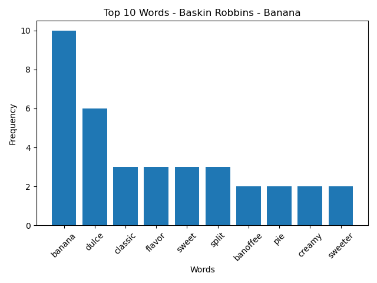
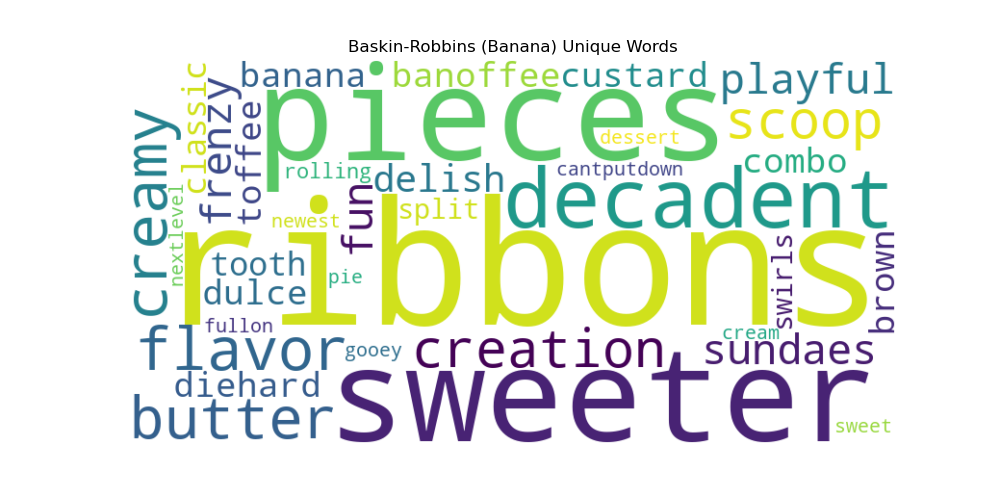

### Baskin-Robbins (Dubai Campaign)
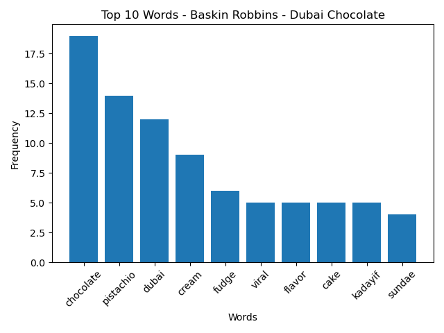
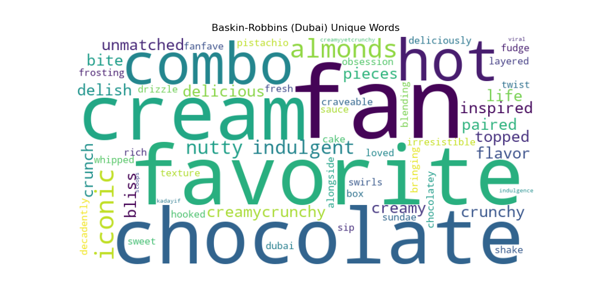

### McDonald's
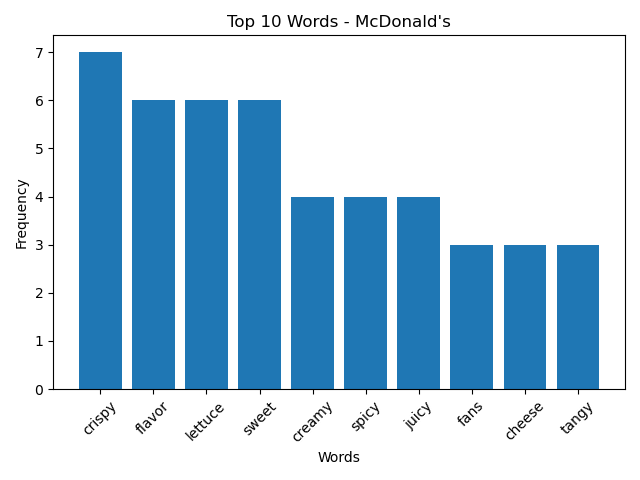
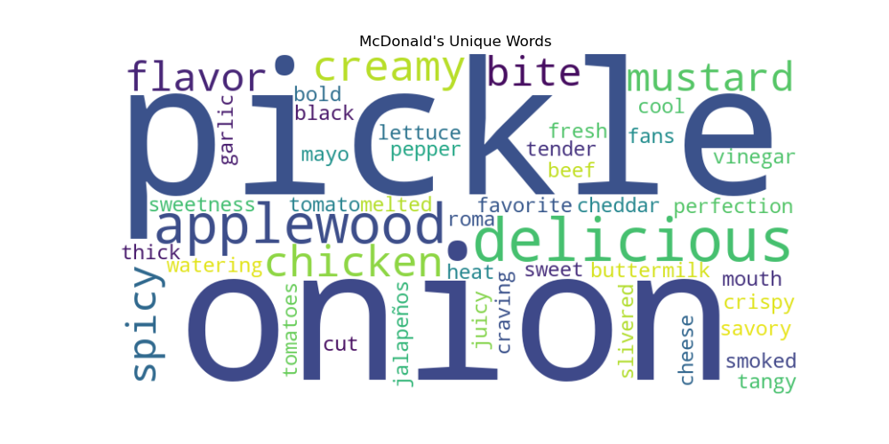

## Healthy Brands Graphs

### Sweetgreen (Wraps Campaign)
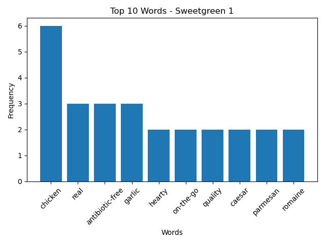
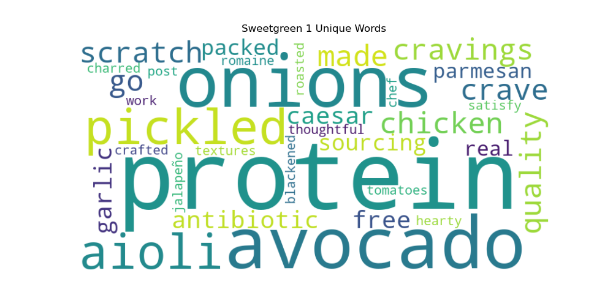

### Sweetgreen (Function Collab)
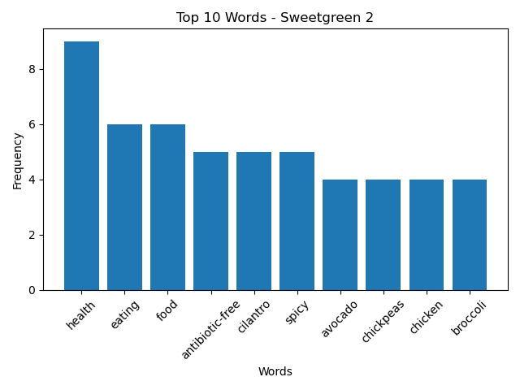
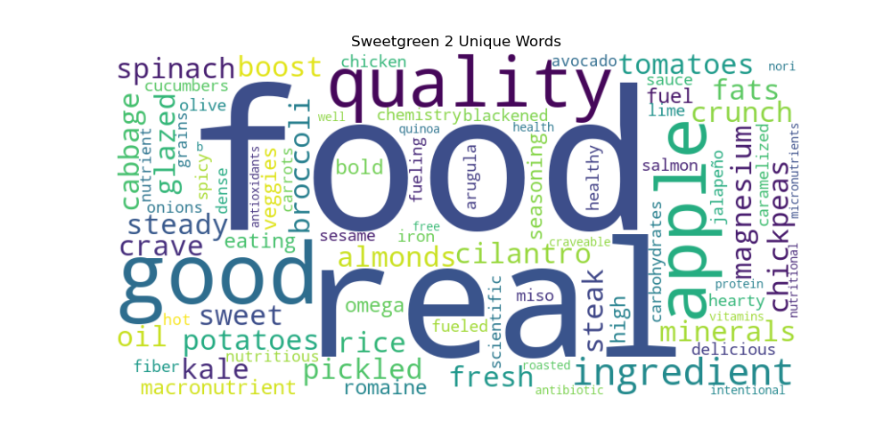

### Chobani
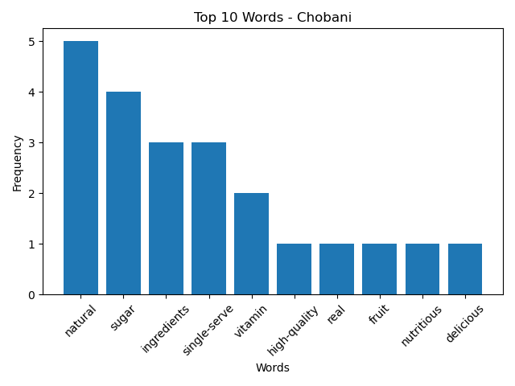
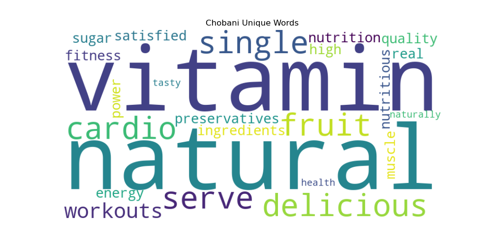

## Conclusion: [What I found easier in this project was the text procurement and individuality that I could integrate. I feel like in the first project, I was still gaining my footing on Python as a whole and how everything worked i.e. functions, loops, etc. But, for text analysis, it's much more flexible and there are multiple ways to do things. What I found difficult was maintaining integrity of the original raw text file. I wanted to get rid of many of the stop words but there were some that AI recommended to remove that I disagreed on and still kept because I felt like it was valuable to the overall analysis. What ended up surprising me was that the text analysis results that I got were pretty consistent with my predictions and original assumptions. I thought that there was going to be a little bit of overlap and gray areas but it seemed like the results were steadily matching with the branding strategy of what one would think of from healthy vs. indulgent brands.]
